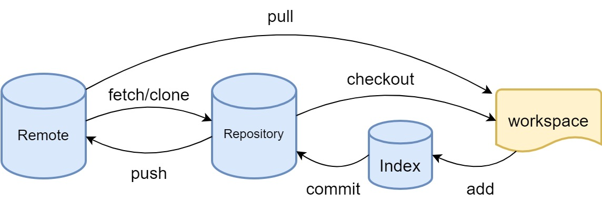

# Linux命令

收集常用的Linux命令

## tmux

tmux，终端复用器，主要作用是在一个终端同时管理多个会话/窗口

### 一、常见命令

启动tmux，进入新的会话，会话名为0/1/2/3/...

```bash
tmux
```

新建会话，并且命名

```bash
tmux new -s <session>
```

查看现有会话

```bash
tmux ls
```

重新进入会话

```bash
tmux attach -t <session>
```

关闭会话

```bash
tmux kill-session -t <session>
```

### 二、快捷键

退出但不关闭会话

```css
Ctrl + b d
```

显示所有窗口

```css
Ctrl + b w
```

按编号切换窗口

```css
Ctrl + b <number>
```

关闭当前窗口

```css
exit 或 Ctrl + d
```

复制模式（滚动查看历史输出）

```css
Ctrl + b [
```

推出复制模式

```css
q
```


---


## git

git是最先进的分布式版本控制系统

工作原理：



+ workspace： 工作区
+ Index：暂存区
+ Repository：本地仓库区
+ Remote：远程仓库区

### 一、创建版本库

将当前目录变成git管理的仓库：

```bash
git init
```

当前目录下会多一个`.git`目录，用于git跟踪管理版本。

将文件添加进暂存区：

```bash
git add <file> / git add .
```

将文件提交到仓库：

```bash
git commit -m "提交说明"
```

检查工作区文件状态：

```bash
git status
```

查看文件修改内容：

```bash
git diff <file>
```

### 二、版本回退

查看git提交记录：

```bash
git log
```

git log显示从近到远的显示日志，包括版本号、作者、时间、提交说明。

查看git提交记录的简洁形式：

```bash
git log --pretty=oneline
```

回退上一版本：

```bash
git reset --hard HEAD^/^^......
```

回退前n个版本：

```bash
git reset --hard HEAD~n
```

回退后使用git log会发现失去对应的历史记录信息。

通过版本号回到指定版本：

```bash
git reset --hard <版本号>
```

获得本地仓库的做过的所有操作记录，如commit、merge、reset、checkout、rebase、pull、fetch

```bash
git reflog
```

### 三、撤销修改与文件删除

撤销文件在工作区的修改/删除：
```bash
git checkout -- <file>
```

命令中的--很重要，没有--的话就变成创建分支的命令了。

删除暂存区的文件：

```bash
git reset HEAD <file>
```

HEAD表示指向最新的提交。

删除工作区的文件，我们只需要将文件rm，此时add进暂存区后commit进仓库可以删除仓库文件。

```bash
git rm <file>
```

### 四、远程仓库

生成 SSH key：

```bash
ssh-keygen -t ed25519 -C "your_email@example.com"
```

公钥内容：

```bash
cat ~/.ssh/id_ed25519.pub
```

添加远程仓库：

```bash
git remote add <remote-ame> <仓库链接>
```

删除远程仓库：

```bash
git remote remove <remote-name>
```

查看远程仓库信息：
```bash
git remote -v
```

查看本地分支信息：
```bash
git branch -v/vv
```

获取远端信息：

```bash
git fetch origin
```

查看远程分支：
```bash
git branch -r
```

推送/拉取分支：

```bash
git push/pull <remote-name> <local-branch>:<remote-branch>
git push/pull <remote-name> <branch>
git push/pull
```

将本地分支与远程分支建立链接：
```bash
git branch --set-upstream <branch-name> <remote-name>/<remote-branch-name>
```

### 五、创建与合并分支

创建分支：

```bash
git branch <name>
```

切换分支：
```bash
git checkout <name>
```

创建并切换分支：

```bash
git checkout -b <name> <remote-name>/<branch-name>
```

查看当前分支：

```bash
git branch
```

合并分支：
```bash
git merge <name>
```

删除分支：
```bash
git branch -d <name>
```

### 六、储藏

将已跟踪的文件储藏起来，恢复工作区：
```bash
git stash save "储藏说明"
```

查看储藏列表：
```bash
git stash list
```

恢复储藏：

```bash
git stash apply stash@{0}
```

删除储藏：

```bash
git stash drop stash@{0}
```

恢复最近一次储藏，并删除

```bash
git stash pop
```

